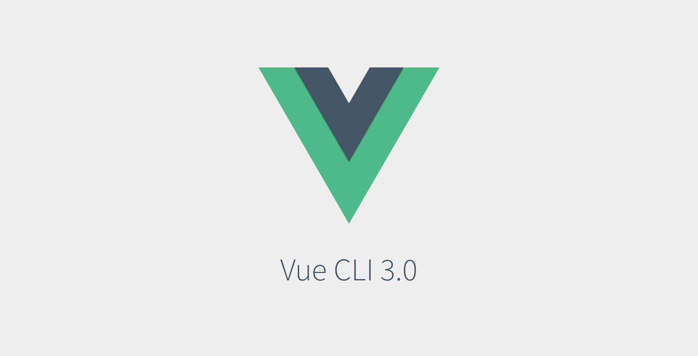

# 뷰 CLI
  
<code>싱글 컴포넌트 체계</code>(각각의 컴포넌트를 .vue 파일로 
분리하여 관리하는 체계)를 사용하기 위해서는 웹 앱의
자원(HTML, CSS, 이미지) 등을 자바스크립트 모듈로 변환해
하나로 묶는 도구인 <code>모듈 번들러</code>가 필요하다.  
모듈 번들러에는 <code>웹팩(Webpack)과 브라우저파이(Browserify)</code> 
등이 있다.  
하지만 이런 도구들을 따로 배우지 않고 사용하기에는 무리가 있다.   

그래서 좀 더 쉽게 뷰 프로젝트를 구성할 수 있도록 <code>뷰 CLI</code>(Command Line Interface)라는 도구가 있다.  
CLI의 명령어를 이용하여 뷰 프로젝트의 구조를 구성할 수 있다.  

## 뷰 CLI 설치
명령 프롬로트/터미널을 실행한 후 명령어를 입력한다.
<pre>
npm i vue-cli -global
</pre>
설치 후 뷰 CLI 실행
<pre>
vue
</pre>
이후 뷰 CLI 명령어가 인식된다
## vue init
뷰 개발을 시작할 때 뷰 CLI 의 vue init 명령어로 초기 프로젝트를 구성할 수 있다.  
vue init 의 템플릿 종류  

템플릿 종류 | 설명
----------- | ----
vue init webpack | 고급 웹팩 기능의 프로젝트 구성. 테스팅, 문법검사 기능
vue init webpack-simple | 웹팩 최소 기능의 프로젝트 구성. 프로토타입 용
vue init browserify | 고급 브라우저리파이 기능의 프로젝트 구성. 테스팅, 문법검사 기능
vue init browserify-simple | 브라우저리파이 최소 기능의 프로젝트 구성. 프로토타입 용
vue init simple |  최소 뷰 기능의 HTML 파일 1개 생성
vue init pwa | 웹팩 기반 프로그래시브 웹 앱(PWA) 기능의 뷰 프로젝트

## 뷰 CLI 템플릿의 특징  
1. 웹 팩이나 브라우저리파이 같은 모듈 번들러를 프로젝트에 포함하여 사용
2. .vue 파일을 HTML,CSS,JS 로 변환하는 뷰 로더(Vue Loader)를 포함하고 있음
