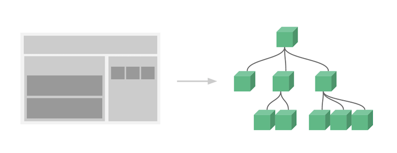

# Vue Component  

## 컴포넌트(component)란?  
컴포넌트란 화면을 구성하는 블록을 의미한다.  
컴포넌트를 나누어 개발하면 빠르고 구조적으로 개발할 수 있고 코드의 재사용이 용이하다.  
  
뷰 에서는 내비게이션 바, 테이블, 리스트, 인풋박스 등 화면을 구성하는 요소들을 나누어 각각의 컴포넌트로 관리한다.  
  
위 그림에서 왼쪽의 웹의 도식중 분할된 영역 하나 하나가 컴포넌트 이며  
오른쪽 그림은 컴포넌트 간의 관계를 나타낸다.  이 컴포넌트의 관계는 트리 자료구조이다.  
