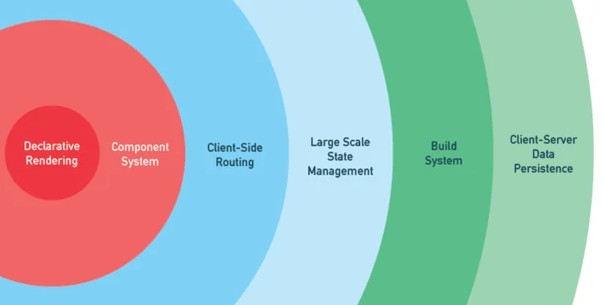
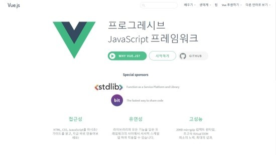
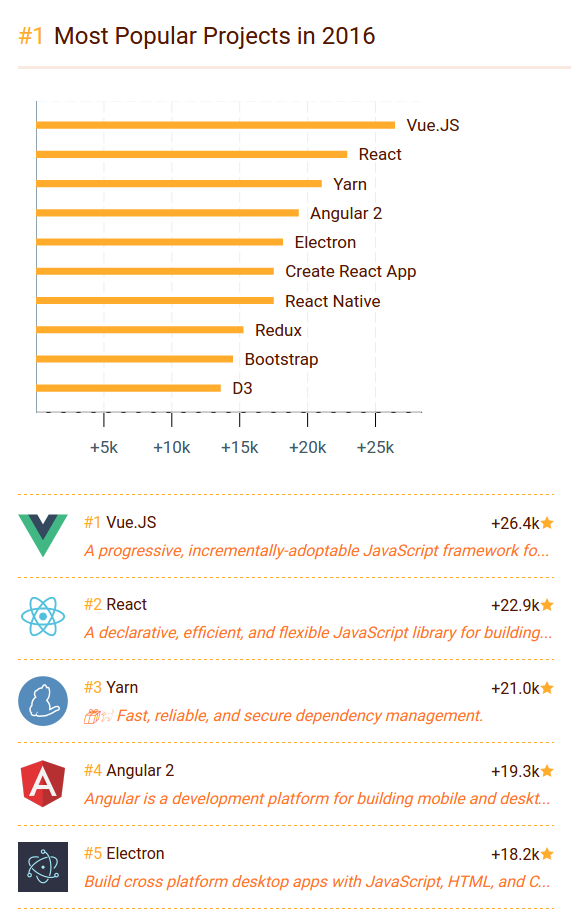
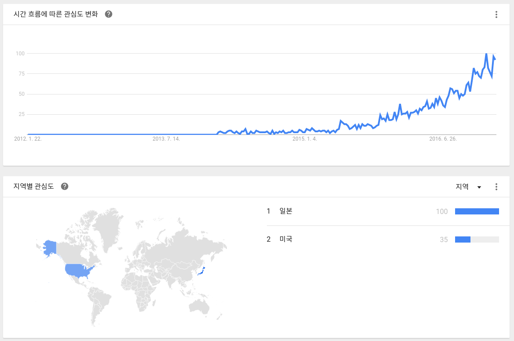
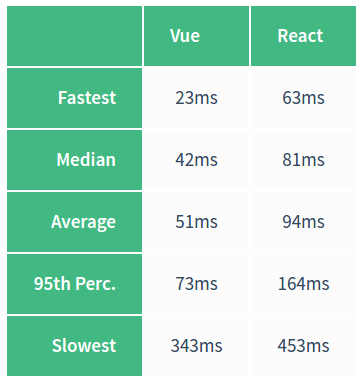

# Vue.js 란?

## 프론트엔드 자바스크립트 프레임워크
한마디로 요약하면 Vue.js(약칭 뷰)는 <code>프론트엔드 자바스크립트 프레임워크</code>이다.  
Angular, Backbone, React 에 비하여 매우 작고 가벼우며, 복잡도가 낮다.  
사용하기에 매우 간편하고, 시작하기도 쉽다.  

프론트엔드 프레임워크를 처음 접한다면 Vue.js로 시작하는 게 좋을 것 같다.  


## 점진적인 프레임워크  
  

위 그림은 뷰의 창시자인 에반 유(Evan You)가 2017년 Vue.js 컨퍼런스에서 발표한 프레젠테이션에서 사용된 그림이다.  
뷰 코어 라이브러리는 명시적 렌더링 기능을 지원하지만 프레임워크의 기능인 컴포넌트 기반, 라우터, 상태관리, 테스팅 등의 기능도 제공한다.  
즉, 라이브러리 뿐 아니라 프레임워크로서의 역할도 한다는 것이다.  
이러한 성질때문에 vue.js의 공식홈페이지에서는 뷰를 점진적인 프레임워크(Progressive Framework)라고 설명하고 있다.  

[한국 공식 홈페이지](https://kr.vuejs.org/)  


## Vue.js 의 성장성  
  
Vue.js 는 2016년 깃허브 소스 코드 기반 리포지터리 중 가장 많은 별을 받을 정도로 인기가 많다.  

현재 시장 점유율은 기존에 있던 Angular 나 React에 비해 상대적으로 낮다.   
하지만 구글 트렌드로 본 검색트렌드에서 급격한 성장세를 보이고 있어 이 시기에 배우기에는 좋은 프레임워크인 것 같다.

## 뷰의 장점  
1. 배우기가 쉽다.  
2. 리액트와 앵귤러에 비해 성능이 좋고 속도가 빠르다.  
  
10000 개의 컴포넌트를 100번 렌더링 하는 프로젝트의 성능 비교이다.  
확실히 Vue 가 React 에 비해 빠른 것을 알 수 있다.  
3. 리액트와 앵귤러의 장점을 지니고 있다.  
리액트의 장점인 가상 돔, 컴포넌트 기반 등의 특징과  
앵규러의 데이터 바인딩 특성을 모두 지니고 있다.